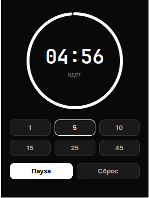

# Таймер

Маленький таймер обратного отсчёта для Hyprland. Питон и GTK3, без зависимостей сверх системных.

**Главное:** закрыл окно — отсчёт продолжается. У таймеров обычно наоборот, а хочется поставить и забыть. При закрытии приходит уведомление «Таймер идёт, осталось N мин»; когда время выйдет — звонок, и окно возвращается само.



## Как пользоваться

Кнопки на 1, 5, 10, 15, 25 и 45 минут, потом «Пуск». Пробел — пуск и пауза, Esc — убрать окно с глаз.

Второе нажатие хоткея не поднимает второй таймер, а показывает уже идущий: приложение одноэкземплярное.

## Установка

```sh
git clone <этот репозиторий> ~/.local/share/timer
```

В `~/.config/hypr/hyprland.conf`:

```
bind = SUPER SHIFT, T, exec, python3 ~/.local/share/timer/timer.py
windowrule = match:class ^(timer)$, float true, center true
```

Класс окна задаётся в коде через `GLib.set_prgname("timer")` — иначе под Wayland он был бы то `timer.py`, то `python3`, и правило перестало бы срабатывать.

## Вид

Ни одного цвета: кольцо, которое убывает, и крупные цифры внутри. Полоска прогресса во всю ширину окна читалась бы как загрузка файла, а не как оставшееся время, поэтому кольцо.

## Чего нет

- Отсчёт не переживает перезагрузку: на диск ничего не пишется.
- Нельзя ввести произвольное время с клавиатуры — только кнопки.
- Нет секундомера. Это другая задача, и мешать их в одном окне не стоит.

## Требуется

`python-gobject`, `gtk3`, `libnotify` (уведомления), `libpulse` (звонок через `paplay`).
